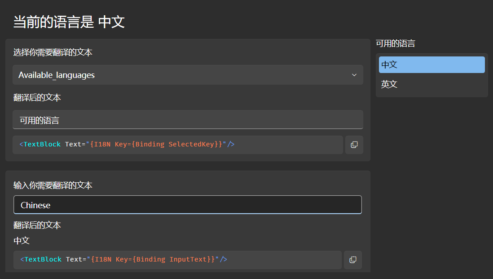
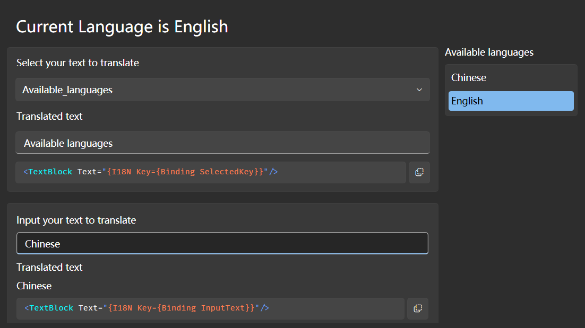

<div align="center">

<h1>

Antelcat.`{I18N}`

</h1>

Reactive language support for .NET applications.

</div>

<p align="center">
    

    
    
</p>

---

🇨🇳 [中文版](./README.md)

## 🗔 Supported Platforms

+ [WPF](https://github.com/dotnet/wpf)
+ [Avalonia](https://github.com/AvaloniaUI/Avalonia)

## 📖 Sample

<div float="right">
    
     
</div>


### Static using
When using `.resx` language file in your project, you can 
automatically generate resource keys by using `Antelcat.I18N.Attributes.ResourceKeysOfAttribute`:

```csharp
using Antelcat.I18N.Attributes;

namespace MyProject

//Auto generated class should be partial
[ResourceKeysOf(typeof(My.Resource.Designer.Type))]
public partial class LangKeys;
```

Then in your `.xaml` file you can use `x:Static` to provide resource key to your control

+ on `Avalonia` platform and using greater than the version of 2.0.0, you should call in `App.axaml`

    ```csharp
    LangKeys.Your_Provider.Initialize();
    ```
  `WPF` can ignore this procedure


if you already have 
```xml
<data name="Language" xml:space="preserve">
    <value>Language</value>
</data>
```
in your `.resx` file, you can use it like this:
```xaml
<TextBolck Text="{x:Static myProject:LangKeys.Language}"/>
```

Then you can use the key to bind the language source using `I18N`

```xaml
<TextBlock Text="{I18N {x:Static myProject:LangKeys.Language}}"/>
```

When you want to change the language, just call

```csharp
using System.Windows;

I18NExtension.Culture = new CultureInfo("language code");
```
You can see the text is changing among the languages.

---

### Dynamic using

Sometimes your source text is not defined in your application but received from other source like network, you can use `I18N` to bind the text directly.

If you receive a json like this:
```json
{
    "message": "This is a message"
}
```
and you have translated it into another language in `.resx` like
```xml
<data name="This is a message" xml:space="preserve">
    <value>这是一条消息</value>
</data>
```

then you put the json into a `Message` property in your view model, you can bind it like this:

```xaml
<!--whose DataContext is your view model-->
<TextBlock Text="{I18N {Binding Message}}"/> 
```

Each time when the `Message` property is changed or the language source is changed, the text will be updated automatically.

---

### Combination and StringFormat

Somebody may want to combine several language sources into one text, you can also use `I18N` and `LanguageBinding` to do this

If you have source text in `.resx` file like this:
```xml
<data name="Current_is" xml:space="preserve">
    <value>当前的 {0} 是 {1}</value>
</data>
<data name="Language" xml:space="preserve">
    <value>语言</value>
</data>
<data name="Chinese" xml:space="preserve">
    <value>中文</value>
</data>
```

and in `.xaml` 

```xaml
<TextBlock>
    <TextBlock.Text>
        <I18N Key="{x:Static myProject:LangKeys.Current_is}">
            <LanguageBinding Key="{x:Static myProject:LangKeys.Language}"/>
            <Binding Path="Language"/> <!--source text from view model-->
        </I18N>
    </TextBlock.Text>
</TextBlock>
```

`I18N.Key` is the `string` template, content accepts `LanguageBinding` and `Binding` to provide the args.